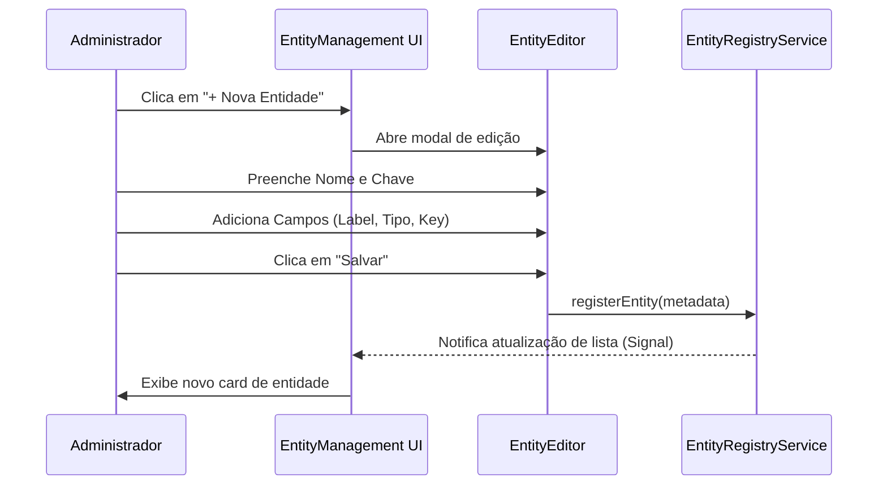
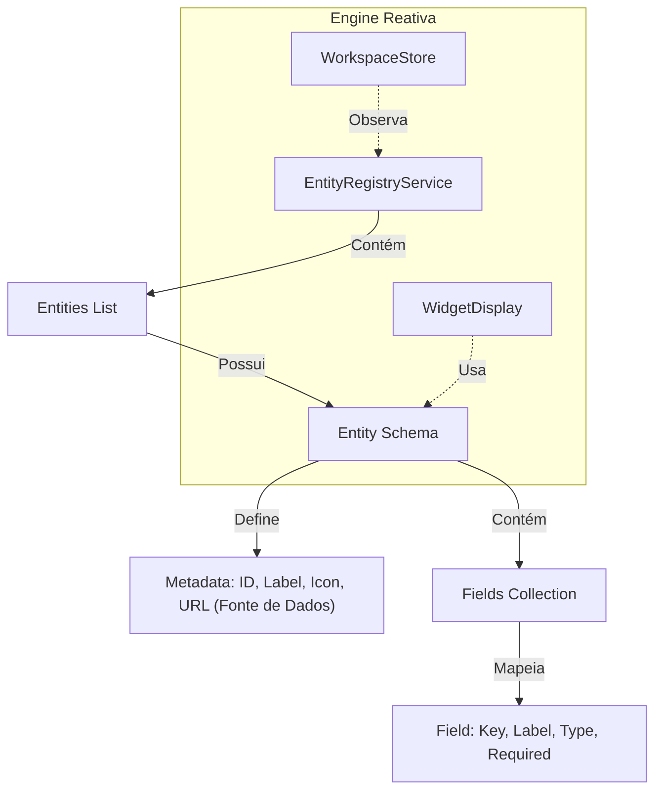

# Feature: Entity Management (Data Modeling Engine)

> Este documento descreve o funcionamento da engine de modelagem de dados do Insight AI, responsável por definir a estrutura das entidades que alimentam os widgets do workspace.

---

## 🏗️ Conceito de Modelagem Dinâmica

O **Insight AI** utiliza uma abordagem *metadata-driven*. As entidades não são apenas classes estáticas; são definições dinâmicas que o sistema usa para:
1.  **Renderizar Formulários**: Criar campos de entrada baseados no tipo do dado.
2.  **Validar Dados**: Garantir que campos obrigatórios e tipos sejam respeitados.
3.  **Mapear APIs (Auto-resolução)**: Através do campo `url` na definição, os widgets podem buscar dados automaticamente sem configuração manual de `dataUrl`.

---

## 📋 Catálogo de Recursos

### 🧠 Serviços Core
- **`EntityRegistryService`**: O repositório central de todas as entidades registradas no sistema. Gerencia o estado reativo (`Signal`) das definições.
- **`EntityFields`**: Definições de tipos suportados: `string`, `number`, `boolean`, `date`, `select`.

### 🖥️ Componentes de Interface
- **`EntityManagementComponent`**: Painel administrativo para visualização e gestão da lista de entidades.
- **`EntityEditorComponent`**: Interface visual para criação e edição de campos e propriedades da entidade.
- **`EntityCard`**: Representação visual resumida de uma entidade na listagem.

---

## 🔄 Diagramas

### Diagrama de Uso: Criação de Entidade
Visualiza o fluxo de um administrador criando uma nova estrutura de dados.

### Diagrama Conceitual: Arquitetura da Entidade
Arquitetura de como os dados são organizados internamente.

---

## ⚙️ Guia de Uso

1.  **Registro de Nova Entidade**: Acesse a aba de Gestão de Entidades e defina a estrutura. O campo **Data URL (Fonte de Dados)** é opcional, mas se preenchido, simplifica o uso no Workspace.
2.  **Integração com Workspace**: Uma vez criada, a entidade aparece como opção na configuração de widgets como `Form`, `List`, `Kanban`, `Table` e `Metric`.
3.  **Extensibilidade**: Para adicionar novos tipos de campos, atualize o enum `FieldType` no core e o mapeamento de renderização no `EntityEditor`.

---
**Documentação gerada para suporte ao desenvolvimento e auditoria de recursos.**
