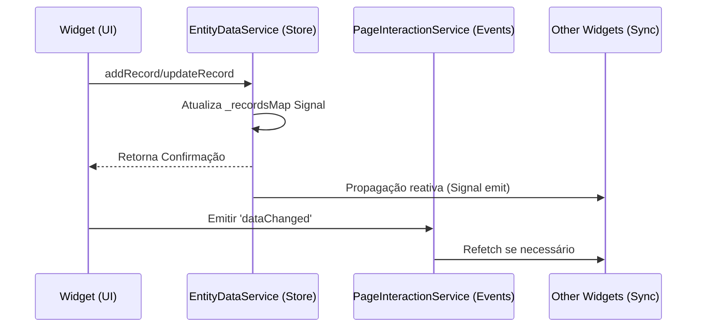
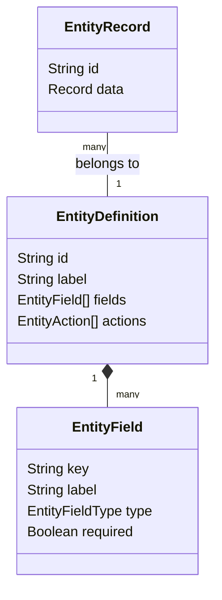

# Representação Visual: Entity Engine Dynamics

Diagramas ilustrando a arquitetura de metadados e o fluxo de persistência reativa.

## 1. Do Schema à UI (Metadata Flow)

O diagrama abaixo mostra como uma definição de classe se torna um formulário funcional.

```mermaid
graph TD
    A[EntityDefinition] --> B[EntityRegistry]
    B --> C{Widget Requester}
    C --> D[FormWidget]
    C --> E[TableWidget]
    
    D --> D1[Loop fields[]]
    D1 --> D2[Build FormGroup]
    D2 --> D3[Render Dynamic Inputs]
    
    E --> E1[Read field.labels]
    E1 --> E2[Render Table Headers]
    E2 --> E3[Map row.data to cells]
```

---

## 2. Ciclo de Vida do Registro (Data Sync)



---

## 3. Modelo de Dados Relacional (Logical Schema)



---
**Visualizando a espinha dorsal de dados do sistema.**
