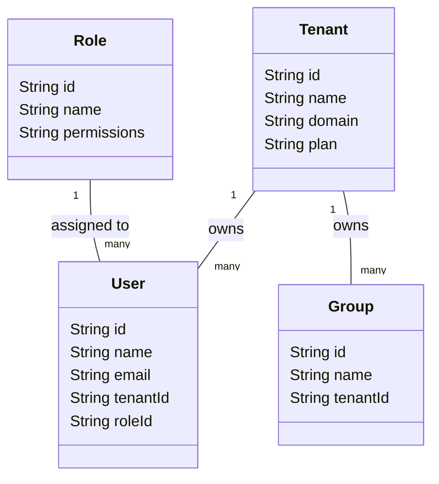
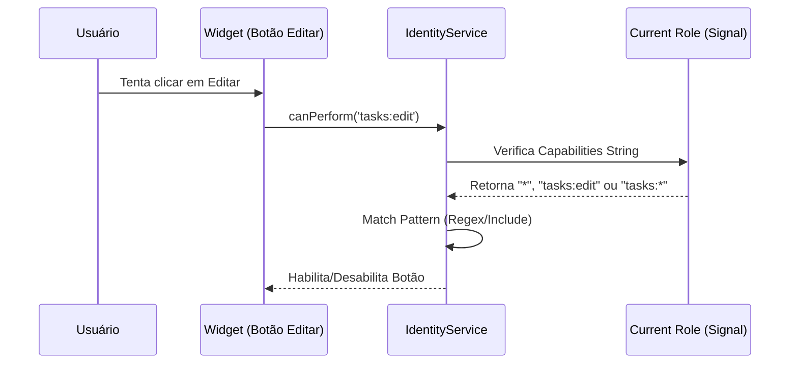

# Representação Visual: Identity & Access Architecture

Este documento ilustra a hierarquia de dados e os fluxos de segurança do motor de Identity.

## 1. Modelo de Entidades SaaS (ER Diagram)

A estrutura abaixo mostra como as entidades de sistema se relacionam para suportar multi-tenancy e papéis.



---

## 2. Fluxo de Validação de Permissão (Capability Flow)

Como o sistema decide se um usuário pode realizar uma ação em um widget.



---

## 3. Isolamento de Dados (Tenant Isolation)

```mermaid
graph TD
    subgraph "Global Data Store"
        R1[Record ID: 001 - Tenant: A]
        R2[Record ID: 002 - Tenant: B]
        R3[Record ID: 003 - Tenant: A]
    end

    subgraph "Current Session (Tenant A)"
        Filter[Filter Context: tenantId === 'A']
        View[User View]
    end

    Global Data Store --> Filter
    Filter --> R1
    Filter --> R3
    Filter -.->|Blocked| R2
```

---
**Diagramas fundamentais para a governança de acesso v0.1.**
