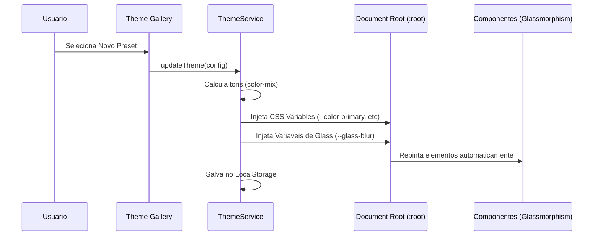
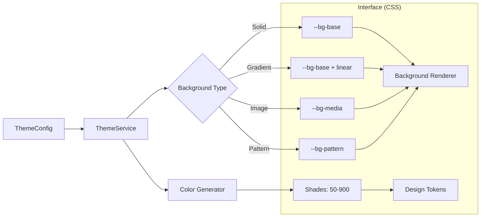

# Feature: Theme Engine (Visual Identity)

> Este documento detalha a engine de estilização dinâmica do Insight AI, capaz de alterar a aparência de toda a plataforma em tempo real sem recarregamento.

---

## 🏗️ Conceito de Layered Rendering

O sistema de temas não gerencia apenas cores. Ele utiliza um sistema de **Renderização em Camadas** para criar interfaces premium:
1.  **Base Layer**: Cores sólidas ou gradientes (via CSS Variables).
2.  **Media Layer**: Imagens de fundo com tratamento de opacidade.
3.  **Pattern Layer**: Padrões SVG repetíveis injetados dinamicamente com a cor primária selecionada.
4.  **Effects Layer**: Sistema de partículas (Canvas/HTML) para dinamismo visual.

---

## 📋 Catálogo de Recursos

### 🧠 Serviços e Lógica
- **`ThemeService`**: O coração do sistema. Calcula tons de cores primárias (50-900), injeta variáveis CSS no `:root` e gerencia a persistência no `localStorage`.
- **`ThemeConfig`**: Modelo de dados que define propriedades como `primary`, `background`, `radius`, `backgroundType`, etc.

### 🖥️ Componentes de UI
- **`ThemePageComponent`**: Tela principal de customização do tema.
- **`ThemeGalleryComponent`**: Galeria de presets e recursos (imagens, padrões).
- **`BackgroundRendererComponent`**: Componente global que renderiza as camadas de fundo em toda a aplicação.
- **`PalettePicker`**: Interface especializada para seleção de cores e tons.

---

## 🔄 Diagramas

### Diagrama de Uso: Customização de Tema
Fluxo de alteração e aplicação de uma nova identidade visual.

### Diagrama Conceitual: Fluxo de Estilização
Como as propriedades se transformam em visão.

---

## ⚙️ Guia de Uso

1.  **Aplicação do Tema**: O `ThemeService` é provido em `root`, garantindo que qualquer mudança reflita instantaneamente.
2.  **Glassmorphism**: Utilize a variável `--glass-bg` e `--glass-blur` em componentes para garantir que eles se adaptem automaticamente quando um fundo especial (imagem/padrão) for ativado.
3.  **Novos Presets**: Devem ser registrados no `theme-presets.ts` para aparecerem na galeria.

---
**Esta documentação é a fonte oficial da verdade sobre os recursos visuais do Theme Engine.**
