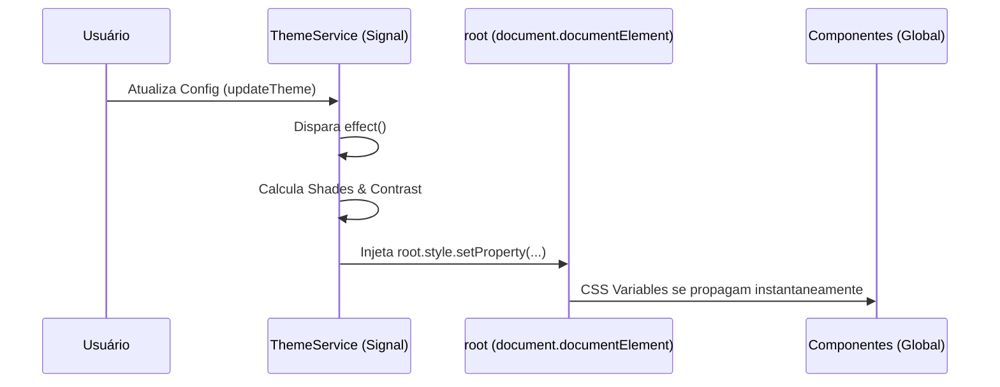
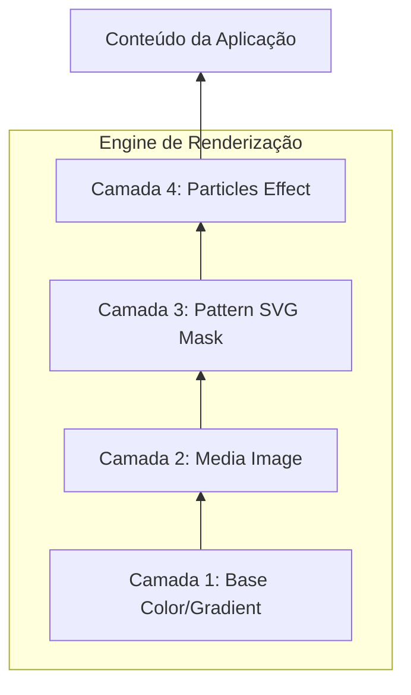
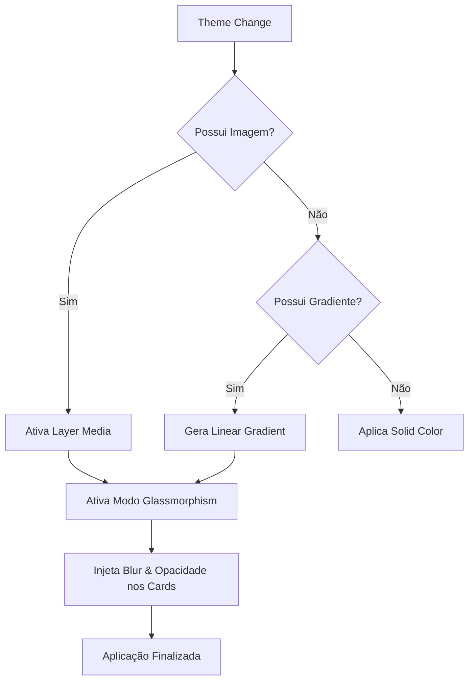

# Representação Visual: Theme Architecture

Diagramas detalhando a injeção de tokens e o sistema de renderização em camadas.

## 1. Fluxo de Injeção de Variáveis (Runtime Path)

---

## 2. Composição do Background (Layer Stack)

O sistema de camadas permite combinações infinitas. A ordem de renderização (Z-Index lógico) é:

---

## 3. Árvore de Decisão de Estilo (Logic Flow)

---
**Este documento demonstra a complexidade técnica por trás da simplicidade visual do InsightAI.**
