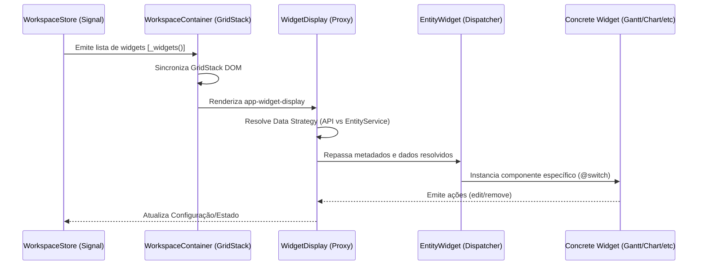
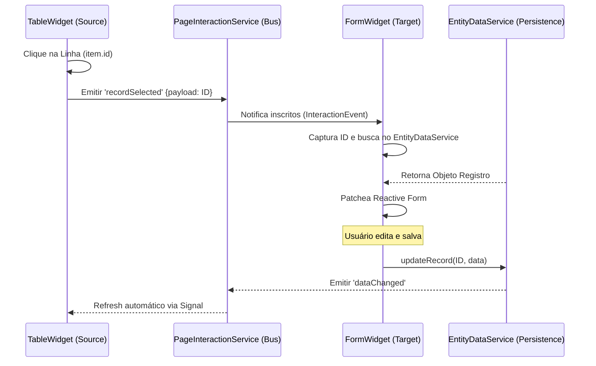
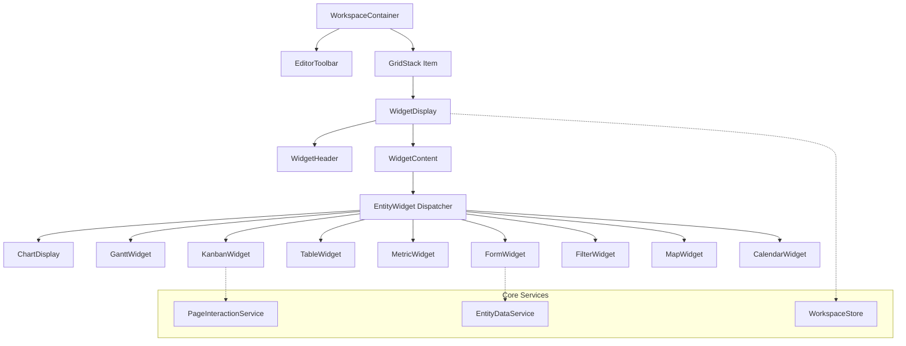
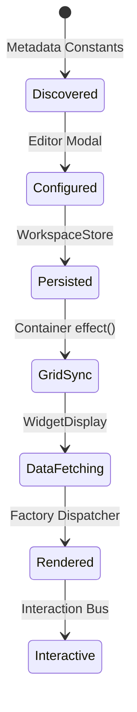

# Representação Visual Exaustiva: Workspace Engine

Este documento apresenta os fluxos de dados e as estruturas de classe que compõe o motor de Workspace.

## 1. Arquitetura de Fluxo de Dados (Data Flow)

O diagrama abaixo ilustra como as configurações do `WorkspaceStore` são destiladas até a renderização do widget final.

---

## 2. Barramento de Interação (Event Bus Interaction)

Diagrama de sequência demonstrando um fluxo Master-Detail entre uma Tabela e um Formulário.

---

## 3. Hierarquia de Componentes (Logical Structure)

---

## 4. Ciclo de Vida do Widget (Config to Render)

---
**Diagramas gerados para a versão 2.0 do motor.**
