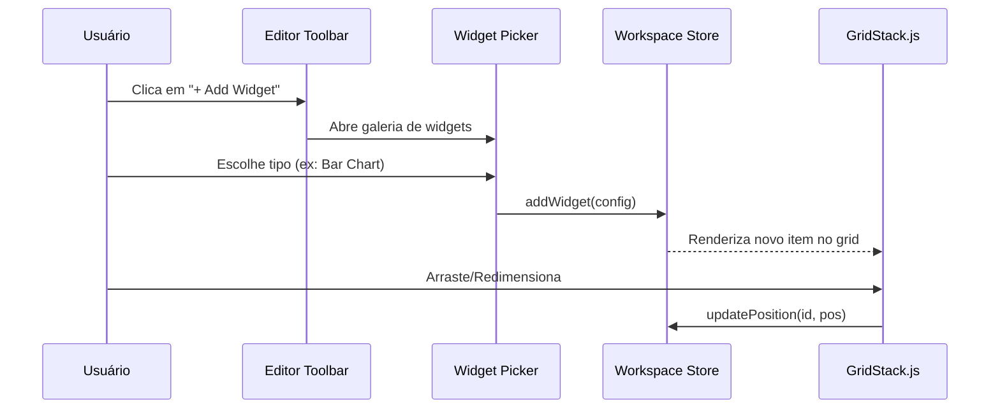
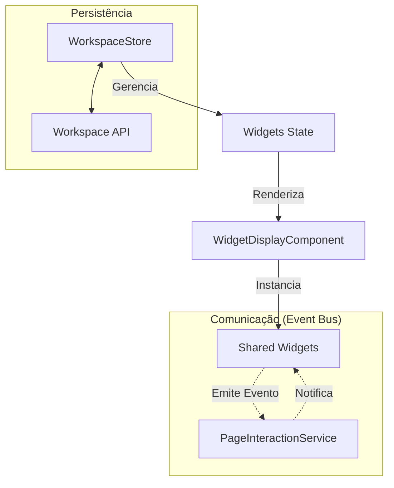

# Feature: Workspace & Page Engine Knowledge Base

> Este documento serve como o **Cérebro da Feature**. Ele descreve todos os recursos, widgets e capacidades do sistema para que desenvolvedores e IAs entendam o que está disponível sem precisar ler todo o código.

---

## 🏗️ Conceito de "Page Engine"

O **Insight AI** não é apenas um dashboard estático. Ele opera sobre um **Page Engine** que desacopla a visualização da lógica de negócios.
- **Entidades**: O sistema entende objetos de negócio (ex: `Tarefa`, `Cliente`).
- **Composição**: Páginas são montadas arrastando widgets que se auto-configuram para uma entidade.
- **Interatividade**: Widgets não são ilhas; eles trocam mensagens via barramento de eventos.

---

## � Catálogo de Widgets (Recursos Disponíveis)

Cada widget abaixo pode ser adicionado ao Workspace. Eles possuem comportamentos específicos dependendo do seu tipo:

### 📊 Visualização Analítica (Charts)
Widgets baseados em ECharts para análise de dados:
- **Linha (`chart-line`)**: Ideal para séries temporais e tendências.
- **Área (`chart-area`)**: Exibe volume acumulado.
- **Barras (`chart-bar`, `chart-bar-horizontal`)**: Comparação quantitativa entre categorias.
- **Pizza/Donut (`chart-pie`)**: Proporções de um total.
- **Heatmap (`chart-heatmap`)**: Densidade de dados em grade térmica.
- **Boxplot (`chart-boxplot`)**: Distribuição estatística e detecção de outliers.
- **Misto (`chart-mixed`)**: Combinação de barras e linhas em um único eixo.
- **KPI (`metric`)**: Card de destaque para um único número chave com indicador de tendência. Suporta mapeamento de valor principal e o novo **Modo Minimalista** para exibição transparente.

### 📋 Gestão de Dados (Page Engine Widgets)
Estes widgets são "Vivos" e reagem à entidade selecionada:
- **Kanban (`kanban`)**: 
    - **O que faz**: Organiza registros em colunas de fluxo (ex: a fazer, fazendo, feito).
    - **Recursos**: Arraste entre colunas, tags de prioridade e meta-informações dinâmicas.
- **Listagem (`list`)**:
    - **O que faz**: Exibe uma lista interativa de registros da entidade.
    - **Interação**: Emite sinal de "Registro Selecionado" para outros widgets quando uma linha é clicada.
- **Formulário (`form`)**:
    - **O que faz**: Renderiza campos dinâmicos para criação ou edição de registros.
    - **Contexto**: Se um `list` selecionar um registro, este formulário carrega os dados dele automaticamente.

### ⚡ Interação e Ação
- **Botão de Ação (`action-button`)**: Dispara processos manuais ou automações via barramento de eventos.
- **Card de Entidade (`entity-card`)**: Exibição 360º de um único registro com detalhes ricos.
- **Tabela de Dados (`table`)**: Grade dinâmica para visualização de grandes volumes. Suporta mapeamento seletivo de colunas e ordenação.
- **Bloco de Texto (`text`)**: Bloco para anotações, diretrizes ou descrições ricas.

---

## 🔄 Diagramas

### Diagrama de Uso: Composição do Workspace
Fluxo de criação e configuração de widgets.

### Diagrama Conceitual: Arquitetura do Workspace
Fluxo de dados e eventos entre componentes.

---

## 🔄 Barramento de Interação (Event Bus)

A inteligência do sistema reside na comunicação entre widgets via `PageInteractionService`.

| Evento | Quem Dispara | Quem Reage | Efeito |
| :--- | :--- | :--- | :--- |
| `recordSelected` | `list`, `kanban` | `form`, `entity-card` | Atualiza o widget para o contexto do registro escolhido. |
| `actionTriggered` | `action-button` | Sistema / APIs | Executa um comando ou lógica customizada. |
| `dataUpdated` | `form` | `list`, `charts` | Recarrega widgets para refletir mudanças nos dados. |

---

## 🎨 Personalização e UX

O Workspace oferece recursos de design premium:
- **Modos**: Alternância entre `Viewer` (consumo) e `Editor` (composição).
- **Paletas de Cores**: Indigo, Rose, Emerald, Violet, Sky — aplicados a todos os gráficos e botões.
- **Tema**: Dark Mode e Light Mode com adaptação inteligente de contraste.
- **Modo Minimalista (`hideCard`)**: Opção para esconder o fundo e o título do widget (fora do editor), permitindo integrações visuais mais limpas para KPIs.
- **Grid Magnético**: Redimensionamento e reposicionamento com detecção de colisão via GridStack.js.

---

## ⚙️ Guia para IA (Como interagir)

Se você é uma IA atuando neste workspace, saiba que:
1.  **Metadados**: Estão em `widget-metadata.constants.ts`. Use-os para saber ícones e labels padrão.
2.  **Estado Global**: Use o `WorkspaceStore` (Signals) para ler o modo atual ou a versão ativa.
3.  **Widgets Novos**: Devem ser criados em `shared/widgets` e registrados no `WidgetDisplayComponent`.
4.  **Entidades**: São registradas no `EntityRegistryService` dentro do `core/page-engine`.

---
**Esta documentação é a fonte oficial da verdade sobre os recursos do Workspace.**
